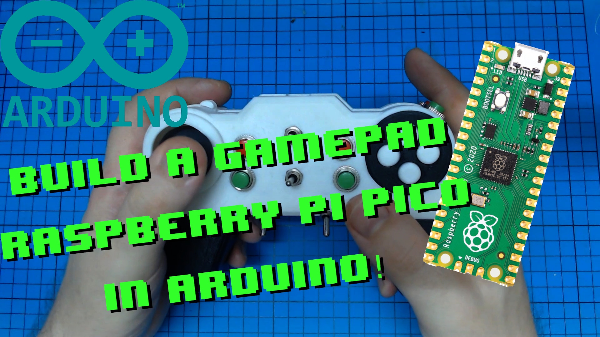

# Raspberry Pi Pico Gamepad/Joystick Library

**Version 1.0.0**

This library works with the Arduino IDE, it is designed to work with the Raspberry Pi Pico, it may work on other RP2040 boards but hasn't been tested.

This library was created for use with the RealRobots [rr_configurator](https://www.gitlab.com/realrobots/rr_configurator) GUI based game controller customization software but is being made available freely for use and modification by others.

[Patreon](https://www.patreon.com/realrobots)

### API

- `send_update()   - Send HID report, values won't be sent until this is called.`

- `SetX(int val)  - Set the value of the X axis with 16 bit precision	 -32767 to 32767`

- `SetY(int val)  - Set the value of the Y axis with 16 bit precision	 -32767 to 32767`

- `SetZ(int val)  - Set the value of the Z axis with 16 bit precision	 -32767 to 32767`

- `SetRx(int val) - Set the value of the Rx axis with 16 bit precision	 -32767 to 32767`

- `SetRy(int val) - Set the value of the Ry axis with 16 bit precision	 -32767 to 32767`

- `SetRz(int val) - Set the value of the Rz axis with 16 bit precision	 -32767 to 32767`

- `SetThrottle(int val) - Set the value of the Throttle axis with 16 bit precision	 -32767 to 32767`

- `SetS0(int val) - Set the value of the S0 axis with 16 bit precision	 -32767 to 32767`

- `SetButton(int idx, bool state) - Sets the state of any of the buttons, indexed 0-127`

- `SetHat(int idx, int dir) - Set the direction of hats indexed 0-3.` 

  -  `direction is clockwise 0=N 1=NE 2=E 3=SE 4=S 5=SW 6=W 7=NW 8=CENTER`

  
[](https://www.youtube.com/watch?v=CNF7G-1LniI)
### Example

```c++
#include <PicoGamepad.h>

PicoGamepad gamepad;

// 16 bit integer for holding input values
int val;

void setup() {  
  Serial.begin(115200);
  
  pinMode(LED_BUILTIN, OUTPUT);

  // X Potentiometer on pin 26
  pinMode(26, INPUT);
  // Y Potentiometer on pin 27
  pinMode(27, INPUT);

  // Button on pin 
  pinMode(28, INPUT_PULLUP);
}

void loop() {

  // Get input value from Pico analog pin
  val = analogRead(26);

  // Map analog 0-1023 value from pin to max HID range -32767 - 32767
  val = map(val, 0, 1023, -32767, 32767);

  // Send value to HID object
  gamepad.SetX(val);

  // Repeat with Y pin
  val = analogRead(27);
  val = map(val, 0, 1023, -32767, 32767);
  gamepad.SetY(val);
  
//  gamepad.SetZ(val);
//  gamepad.SetRx(val);
//  gamepad.SetRy(val);
//  gamepad.SetRz(val);
//  gamepad.SetS0(val);
//  gamepad.SetS1(val);

  // Set button 0 of 128 by reading button on digital pin 28
  gamepad.SetButton(0, !digitalRead(28));

  // Set hat direction, 4 hats available. direction is clockwise 0=N 1=NE 2=E 3=SE 4=S 5=SW 6=W 7=NW 8=CENTER 
  // gamepad.SetHat(0, 8);


  // Send all inputs via HID 
  // Nothing is send to your computer until this is called.
  gamepad.send_update();

  // Flash the LED just for fun
  digitalWrite(LED_BUILTIN, !digitalRead(LED_BUILTIN)); 
  delay(100);
}

```

